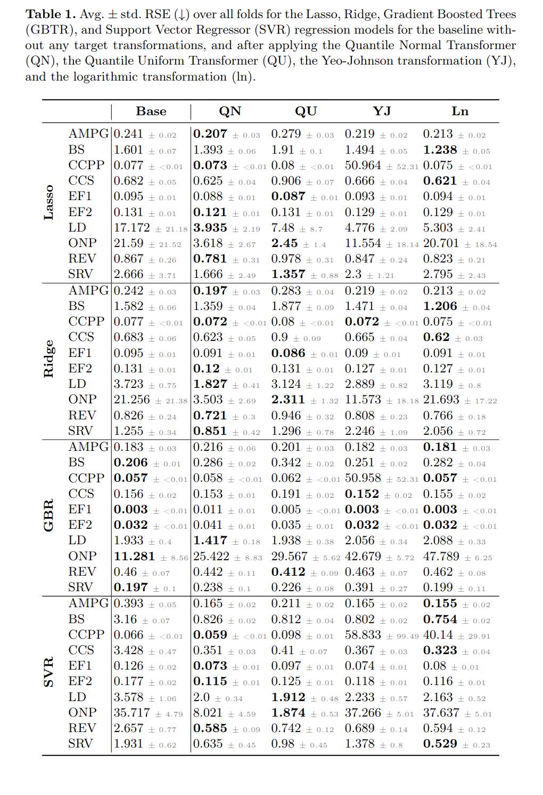
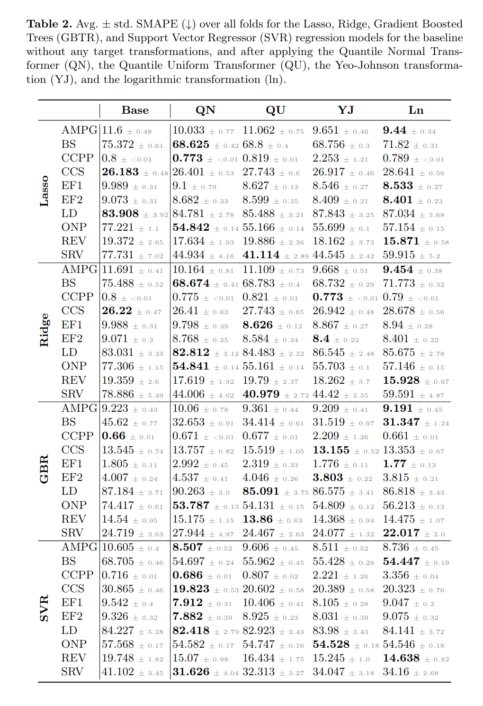

# Additional results
Due to space limitations, only the results for the Lasso and Support Vector Regressor (SVR) regression models are shown in the paper. Below are the full results for all four included regression models: Lasso, Ridge, Gradient Booster Trees (GBTR), and Support Vector Regressor (SVR) regression models.



# How to run the experiments
## Unsuitable Target Distribution
First, a directory to store the datasets in has to be defined:
```
export DATA_DIR=<path_to_datasets_dir>
```
And a directory to store the results in:
```
export RESULTS_DIR=<path_to_results_dir>
```
Then, run the experiments with:
```
python3 -m src.experiments.imbalanced_distribution <dataset>
```
where \<dataset\> is either
- the name of a dataset from src.experiments.data
- "all", which will run all datasets included in the paper

Finally, the LateX table can be generated with:
```
python3 -m src.experiments.print_results.run imbalanced_distribution -d <dataset> --latex
```
